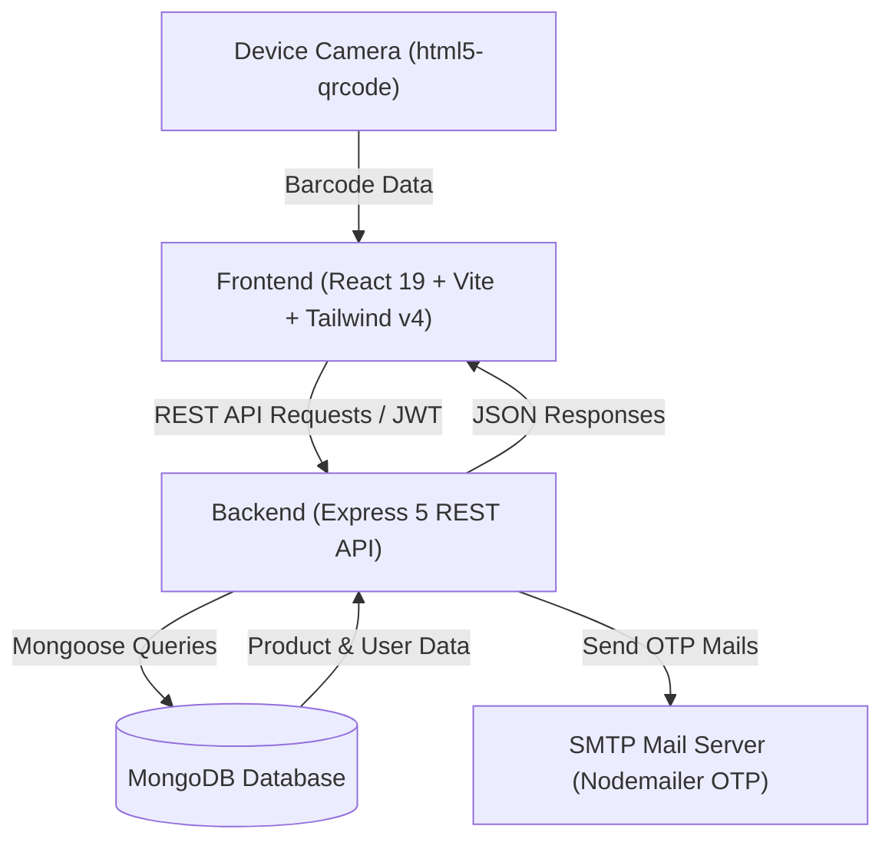

# 🥗 KnowYourProduct

> **Decode What You Eat** — A modern full-stack web application designed to empower consumers with instant, transparent nutritional analysis, ingredient risk evaluation, and smart health scoring via real-time barcode scanning.

[](https://react.dev/)
[](https://vitejs.dev/)
[](https://tailwindcss.com/)
[](https://nodejs.org/)
[](https://expressjs.com/)
[](https://www.mongodb.com/)
[](#-key-features)
[](https://github.com/tanishpal23)

---

## 📖 Table of Contents

- [Overview](#-overview)
- [Key Features](#-key-features)
- [Tech Stack](#-tech-stack)
- [Project Architecture](#-project-architecture)
- [Directory Structure](#-directory-structure)
- [API Reference](#-api-reference)
- [Getting Started](#-getting-started)
  - [Prerequisites](#prerequisites)
  - [1. Backend Setup](#1-backend-setup)
  - [2. Database Seeding](#2-database-seeding)
  - [3. Frontend Setup](#3-frontend-setup)
- [Environment Variables](#-environment-variables)
- [Deployment](#-deployment)
- [Author](#-author)
- [License](#-license)

---

## 🌟 Overview

Packaged food labels are often confusing, deceptive, and laden with complex chemical names and marketing claims. **KnowYourProduct** solves this problem by turning any smartphone or laptop camera into an instant food scanner. 

Users can scan a product barcode or search by name to receive:
- **Instant Health Score (0–100)**: Evaluated based on macronutrient balance, additives, and degree of processing.
- **Ingredient Risk Level**: Highlighting harmful preservatives, artificial sweeteners, trans fats, and hidden sugars.
- **Allergen Alerts**: Instant warnings for dairy, gluten, nuts, soy, and other common allergens.
- **Better Alternatives**: Healthier product suggestions within the same category.

---

## ✨ Key Features

### 📷 Real-Time Barcode Scanner
- Integrated with `html5-qrcode` to scan standard retail barcodes (EAN-13, UPC-A, etc.) directly using the browser camera.
- Manual barcode input fallback for devices without camera access or poorly lit labels.

### 🔬 Nutritional Analysis & Smart Scoring
- Evaluates nutrition facts per 100g / serving (energy, protein, sugars, sodium, fiber, saturated fat).
- Categorizes additives with risk ratings (Safe, Moderate, High concern).
- NOVA classification for ultra-processed food detection.

### ⚖️ Side-by-Side Product Comparison
- Compare two or more products directly to make data-backed purchasing decisions.
- Visual breakdown contrasting calories, macros, ingredient quality, and overall health scores.

### 🔍 Search & Filtering
- High-performance text search backed by MongoDB compound text indexes.
- Filter by category, health score range, brand, and dietary tags (Vegan, Gluten-Free, Organic, Low Sugar).

### 👤 User Dashboard & History
- Secure JWT-based user authentication.
- Track recent scan history and bookmark favorite products.
- Customizable dietary preferences (e.g., alert on palm oil, artificial colors, or high sodium).

### 🔐 Password Reset with Email OTP
- 6-digit one-time password (OTP) verification powered by Nodemailer.
- Expiration window and secure hashed storage for OTP tokens.

---

## 🛠 Tech Stack

### Frontend
- **Framework**: [React 19](https://react.dev/) + [Vite](https://vitejs.dev/)
- **Styling**: [Tailwind CSS v4](https://tailwindcss.com/)
- **Routing**: [React Router v7](https://reactrouter.com/)
- **Icons**: [@heroicons/react](https://heroicons.com/)
- **Scanner**: [html5-qrcode](https://github.com/mebjas/html5-qrcode)
- **HTTP Client**: [Axios](https://axios-http.com/)
- **Linter**: [oxlint](https://oxc.rs/)

### Backend
- **Runtime**: [Node.js](https://nodejs.org/) (Express 5.x REST API)
- **Database**: [MongoDB](https://www.mongodb.com/) via [Mongoose 9.x](https://mongoosejs.com/)
- **Authentication**: [jsonwebtoken](https://github.com/auth0/node-jsonwebtoken) (JWT) & [bcryptjs](https://github.com/dcodeIO/bcrypt.js)
- **Email Service**: [Nodemailer](https://nodemailer.com/) (Gmail SMTP / custom SMTP for OTPs)
- **Validation**: [express-validator](https://express-validator.github.io/)
- **CORS**: Cross-Origin Resource Sharing middleware

---

## 🏗 Project Architecture



---

## 📂 Directory Structure

```text
knowyourproduct/
├── backend/
│   ├── config/             # Database connection & configurations
│   ├── controllers/        # Request handlers (auth, products, users)
│   ├── middleware/         # Auth verification & request middlewares
│   ├── models/             # Mongoose schemas (User, Product, etc.)
│   ├── routes/             # Express route definitions
│   │   ├── auth.js         # /api/auth routes
│   │   ├── products.js     # /api/products routes
│   │   └── users.js        # /api/users routes
│   ├── seed/               # Database mock data & seeding scripts
│   │   ├── seedData.js     # Base product catalog
│   │   ├── moreProducts.js # Extended product catalog
│   │   └── updateImages.js # Product image sync utility
│   ├── utils/              # Emailer & helper utilities
│   ├── server.js           # Server entry point
│   └── package.json
│
├── frontend/
│   ├── public/             # Static assets & public icons
│   ├── src/
│   │   ├── assets/         # Images, illustrations, and logos
│   │   ├── components/     # Reusable UI components (Navbar, Scanner, etc.)
│   │   ├── context/        # React Context (AuthContext, etc.)
│   │   ├── pages/          # Application views
│   │   │   ├── LandingPage.jsx
│   │   │   ├── ScanPage.jsx
│   │   │   ├── SearchPage.jsx
│   │   │   ├── ProductPage.jsx
│   │   │   ├── ComparePage.jsx
│   │   │   ├── DashboardPage.jsx
│   │   │   ├── LoginPage.jsx
│   │   │   ├── SignupPage.jsx
│   │   │   └── ForgotPasswordPage.jsx
│   │   ├── services/       # Axios API client modules
│   │   ├── App.jsx         # App router & layout container
│   │   └── index.css       # Global styles & Tailwind CSS imports
│   ├── vite.config.js
│   ├── vercel.json         # Frontend SPA routing configuration
│   └── package.json
│
├── .gitignore
└── README.md
```

---

## 🔌 API Reference

### 🔐 Authentication (`/api/auth`)

| Method | Endpoint | Access | Description |
|---|---|---|---|
| `POST` | `/api/auth/register` | Public | Register new user account |
| `POST` | `/api/auth/login` | Public | Authenticate user & return JWT token |
| `GET` | `/api/auth/me` | Private | Get authenticated user profile |
| `POST` | `/api/auth/forgot-password` | Public | Send 6-digit password reset OTP to email |
| `POST` | `/api/auth/verify-otp` | Public | Verify reset OTP token |
| `POST` | `/api/auth/reset-password` | Public | Reset password with verified OTP |

### 🍏 Products (`/api/products`)

| Method | Endpoint | Access | Description |
|---|---|---|---|
| `GET` | `/api/products` | Public | Get paginated list of all products |
| `GET` | `/api/products/search?q=query` | Public | Text search products by name, brand, or tag |
| `GET` | `/api/products/barcode/:barcode`| Public | Fetch product information by scanned barcode |
| `POST` | `/api/products/compare` | Public | Compare multiple products by ID array |
| `GET` | `/api/products/:id` | Optional Auth | Retrieve detailed product profile & ingredients |

### 👤 User Actions (`/api/users`)

| Method | Endpoint | Access | Description |
|---|---|---|---|
| `GET` | `/api/users/dashboard` | Private | Retrieve user dashboard stats & bookmarks |
| `POST` | `/api/users/save/:productId` | Private | Bookmark/save a product to user favorites |
| `DELETE`| `/api/users/save/:productId` | Private | Remove a product from saved favorites |
| `POST` | `/api/users/scan/:productId` | Private | Record a scanned product in history |
| `DELETE`| `/api/users/scan/:productId` | Private | Delete a product from scan history |
| `PUT` | `/api/users/preferences` | Private | Update dietary flags & allergen preferences |

### 🩺 System

| Method | Endpoint | Access | Description |
|---|---|---|---|
| `GET` | `/api/health` | Public | API health check status |

---

## 🚀 Getting Started

### Prerequisites
- **Node.js**: `v18.0.0` or higher
- **npm** or **yarn** / **pnpm**
- **MongoDB**: Local MongoDB instance or free [MongoDB Atlas](https://www.mongodb.com/cloud/atlas) cluster

---

### 1. Backend Setup

1. Open a terminal and navigate to the backend directory:
   ```bash
   cd backend
   ```

2. Install dependencies:
   ```bash
   npm install
   ```

3. Create your `.env` configuration file in `backend/`:
   ```env
   PORT=5000
   NODE_ENV=development
   MONGODB_URI=mongodb+srv://<username>:<password>@cluster.mongodb.net/knowyourproduct?retryWrites=true&w=majority
   JWT_SECRET=your_super_secret_jwt_key_here
   JWT_EXPIRE=7d

   # Nodemailer / Email OTP (e.g. Gmail SMTP)
   EMAIL_HOST=smtp.gmail.com
   EMAIL_PORT=587
   EMAIL_USER=your_email@gmail.com
   EMAIL_PASS=your_gmail_app_password
   EMAIL_FROM=KnowYourProduct <your_email@gmail.com>
   ```

4. Start the backend server:
   ```bash
   npm run dev
   ```
   *The backend will boot up at `http://localhost:5000`.*

---

### 2. Database Seeding

Populate the database with rich mock products, barcodes, and ingredient analyses:

```bash
cd backend

# Seed the full product catalog
npm run seed

# Or run specific seed commands:
npm run seed:fresh    # Seeds baseline products
npm run seed:more     # Appends extended product inventory
npm run update:images # Refreshes product image links
```

---

### 3. Frontend Setup

1. Open a second terminal window and navigate to the `frontend` folder:
   ```bash
   cd frontend
   ```

2. Install dependencies:
   ```bash
   npm install
   ```

3. Create a `.env` file in the `frontend/` directory:
   ```env
   VITE_API_URL=http://localhost:5000
   ```

4. Launch the Vite development server:
   ```bash
   npm run dev
   ```

5. Open your browser at **`http://localhost:5173`**.

---

## ⚙️ Environment Variables

### Backend (`backend/.env`)
| Variable | Required | Description |
|---|---|---|
| `PORT` | No | Port number for Express server (Defaults to `5000`) |
| `MONGODB_URI` | **Yes** | Connection string for MongoDB database |
| `JWT_SECRET` | **Yes** | Cryptographic secret for signing JWT auth tokens |
| `JWT_EXPIRE` | No | Expiration duration (e.g. `7d`, `24h`) |
| `EMAIL_HOST` | For OTP | SMTP server host (e.g. `smtp.gmail.com`) |
| `EMAIL_PORT` | For OTP | SMTP port (`587` for TLS or `465` for SSL) |
| `EMAIL_USER` | For OTP | SMTP account username / email address |
| `EMAIL_PASS` | For OTP | SMTP app password |
| `EMAIL_FROM` | For OTP | Sender name & email string |

### Frontend (`frontend/.env`)
| Variable | Required | Description |
|---|---|---|
| `VITE_API_URL` | **Yes** | Base URL pointing to the Express backend API (e.g., `http://localhost:5000` or production domain) |

---

## 🌐 Deployment

### Frontend (e.g., Vercel / Netlify)
- Built with Vite: `npm run build` outputs to `dist/`.
- Included `frontend/vercel.json` provides rewrite rules ensuring client-side routes (e.g., `/scan`, `/compare`, `/product/:id`) route properly to `index.html`.
- Set `VITE_API_URL` in your hosting dashboard environment variables.

### Backend (e.g., Render / Railway / AWS)
- Ensure the production URL is allowed in `server.js` CORS configuration.
- Add all required backend environment variables (`MONGODB_URI`, `JWT_SECRET`, etc.).
- Start script: `node server.js`.

---

## 👨‍💻 Author

Developed and maintained by **[Tanish](https://github.com/tanishpal23)**.

- **GitHub Profile**: [Tanish](https://github.com/tanishpal23)
- **Project Repository**: [knowyourproduct](https://github.com/tanishpal23/knowyourproduct)

---

## 📄 License

This project is open source and available under the [ISC License](LICENSE).

---

<p align="center">
  Made with ❤️ by <a href="https://github.com/tanishpal23"><strong>Tanish</strong></a> — Empowering healthier, transparent choices one scan at a time.
</p>

